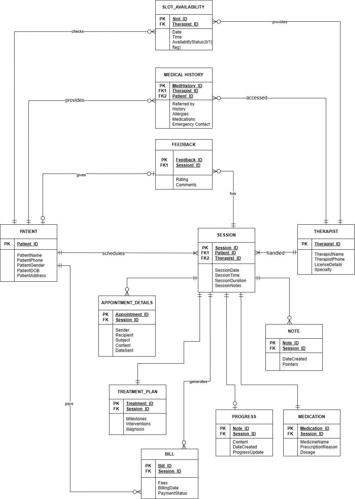

# Remote_Counselling_Management_System (Streamlining Client and Counselor Interactions) | MSSQL, PL-SQL, Tableau  

## Overview

In today's fast-paced society, mental well-being often doesn't receive the attention it deserves. The hustle and bustle of modern life have led to a significant rise in mental health issues, underscoring the need for effective mental healthcare and counselling systems. Many individuals hesitate to seek therapy due to the discomfort of discussing their issues in person. A remote counselling system can bridge this gap by providing accessible mental health support.

## Project Description

This project involves the development of a comprehensive database solution using MSSQL Server, PL/SQL, and data visualization with Tableau to support a remote counselling management system. The system is designed to facilitate seamless interactions between clients and counselors, manage appointments, and track progress, all within a secure and user-friendly environment.

## Repository Contents

- **CREATE TABLE.sql**: SQL script containing the commands to create the necessary database tables for the system.

- **DATABASE OBJECTS.sql**: SQL script defining various database objects such as stored procedures, views, and functions essential for the system's operations.

- **INSERT QUERIES.sql**: SQL script with sample data insertion queries to populate the database tables for testing and demonstration purposes.

- **final ER diagram.drawio.png**: An Entity-Relationship diagram illustrating the database schema, showcasing the relationships between different entities within the system.

- **Tableau Dashboard Version 1.0.pdf**: A PDF document presenting the initial version of the Tableau dashboard, providing visual insights into the system's data and performance metrics.

## ER diagram



## Features

- **Comprehensive Database Design**: Structured schema to manage users, appointments, session logs, and communications.

- **Data Visualization**: Interactive dashboards created with Tableau to monitor system usage and client progress.

- **Scalability**: Designed to accommodate future enhancements, such as integrating additional mental health services.

## Getting Started

To explore or utilize this project:

1. **Clone the Repository**:
   ```bash
   git clone https://github.com/dhirthacker7/Remote-Counselling-management-system.git
   cd Remote-Counselling-management-system
   ```

2. Set Up the Database:

Ensure you have MSSQL Server installed.

Execute the CREATE TABLE.sql script to create the necessary tables.

Run the DATABASE OBJECTS.sql script to set up required database objects.

Populate the database with sample data using the INSERT QUERIES.sql script.

### Review the ER Diagram:

Refer to the final ER diagram.drawio.png to understand the database structure and relationships.

### Explore the Tableau Dashboard:

Open the Tableau Dashboard Version 1.0.pdf to view the data visualizations and insights.
